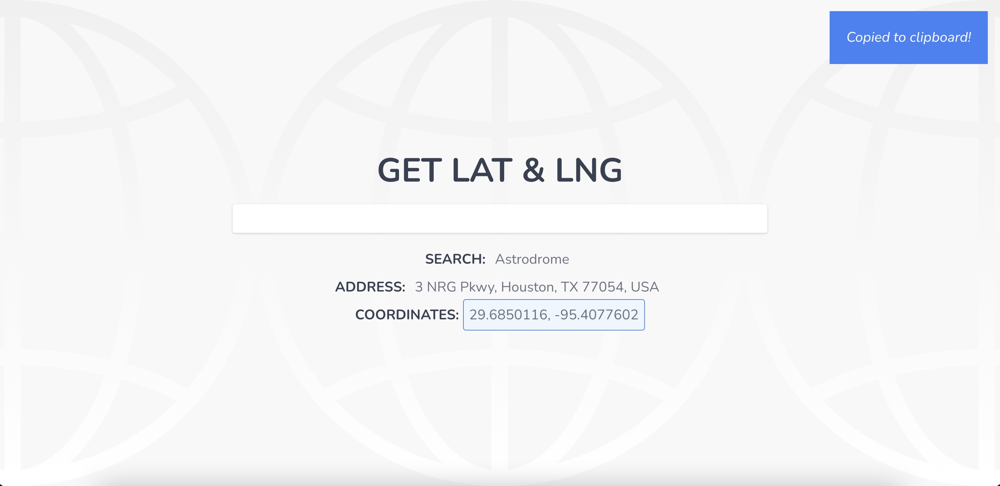

# Get Lat & Lng [GitHub license](https://img.shields.io/badge/license-MIT%20License-blue.svg)

# Live Site

https://iescandon.github.io/get-coords/

## Description

 `

This application is a client-side application that provides users with the coordinates of any location. The user can search by the address or name of the location in the search bar and be provided with the latitude and longitude of their search. Results are provided by Google Maps API. To aid the user, users can simply click on the latitude and longitude and have that information copied to their clipboard. Toasts are included to provide the user feedback when they have copied the coordinates or if the locations wasn’t found. Because of the nature of the targeted users, this app is designed to be very mobile responsive and fully functional on even the smallest screens.

## Table of Contents

- [Installation](#installation)
- [Usage](#usage)
- [Technologies](#technologies)
- [License](#license)
- [Credits](#credits)
- [Tests](#tests)
- [Questions](#questions)

## Installation

In order to install this project, you must login to GitHub and go to github.com/iescandon/get-coords. Once there you will click on the green button that says clone or download. You will be given choices on how to download: using the ssh/html key or downloading the zip file.

Using SSH/HTML Key: You will copy the link shown and open up either terminal (mac: pre-installed) or gitbash (pc: must be installed). Once the application is open, you will type git clone _paste url here_. Once you have cloned the htx-tacos repo, cd into the repo and type "open ." to open the folder which contains all files used for the website. You can also type "code ." to open the repo in VS code.

Using Download ZIP: Click on Download Zip. Locate the file and double click it to unzip the file. Locate the unzipped folder and and open it. All the files for the website will be within this folder.

## Usage

Simply click on the live link listed above and use the website as normal.

## Technologies

- React
- Google Maps API
- Tailwind CSS

## License

Copyright (c) [2020][inezescandon]  
The license is MIT License.  
Read more about it at https://opensource.org/licenses/MIT.

## Credits

None

## Tests

No tests available.

## Questions

If you have any additional questions please contact me at iescan4@gmail.com.  
GitHub: https://github.com/iescandon
